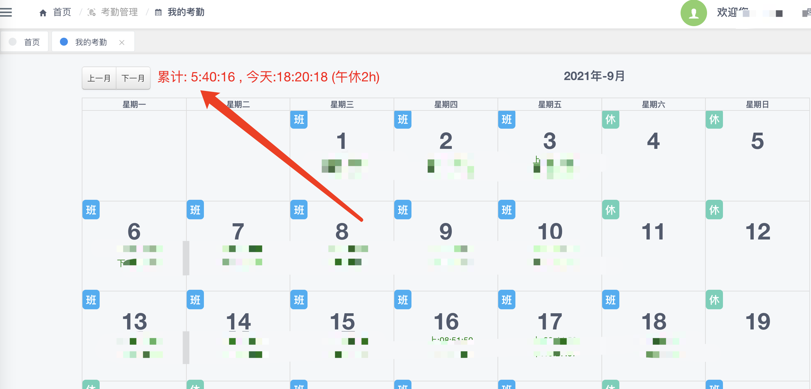

FireFox 扩展 

统计当前月份考勤  
累计余量,当天最早几点下班满足考勤（最早18点，你早上5点来，也是）  
累计为负数,表示后面需要加班补回来。

安装步骤
1. [下载 xpi 文件][xpi_v1.3]
2. 拖动文件到 firefox 安装. 

--- 
预览如图

历史版本  
+ [v1.2][xpi_v1.3.1]  
+ [v1.3][xpi_v1.3]  
+ [v1.2][xpi_v1.2]  

[xpi_v1.2]: https://github.com/vitock/hl-checkin/raw/master/xpi/huoli_checkin-1.2-fx.xpi
[xpi_v1.3]: https://github.com/vitock/hl-checkin/raw/master/xpi/huoli_checkin-1.3-fx.xpi
[xpi_v1.3.1]: https://github.com/vitock/hl-checkin/raw/master/xpi/huoli_checkin-1.3.1-fx.xpi

